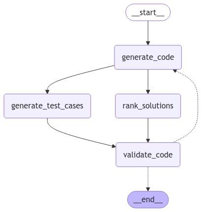

# AlphaCodium

This project implements a streamlined code generation system inspired by the AlphaCodium Paper. While the original paper likely utilizes a sandbox environment for code testing, this implementation includes a simplified validation step using pseudocode to demonstrate the core concepts.

This image shows the high level flow of the code generation system.



## My preferred way to run the code
Use the Quoakka.js extension + console ninja extension to run and inspect the code.

## Install dependencies:

```bash
npm install
```

## Set up environment variables:
   - Copy `.env.example` to `.env`
   - Add your OpenAI API key to `.env`:

```bash
OPENAI_API_KEY="your-api-key-here"
```

## Usage

Run the code generation script:

```bash
npm start
```

This will execute the main script located at `AlphaCodium/code-gen-index.ts`.
